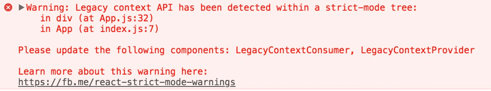

# Strict Mode

### StrictMode là một công cụ để làm nổi bật các vấn đề tiềm ẩn trong một ứng dụng. Giống như Fragment, StrictMode không render bất kỳ giao diện nào. Nó kích hoạt các kiểm tra mở rộng và cảnh báo bổ sung cho các component con.

### Bạn có thể bật chế độ StrictMode cho bất kỳ phần nào trong ứng dụng của mình. Ví dụ :

    import React from 'react';

    function ExampleApplication() {
        return (
            

            <Header />
            <React.StrictMode>
                

                <ComponentOne />
                <ComponentTwo />
                

            </React.StrictMode>
            <Footer />
            

        );
    }

### StrictMode hiện tại hỗ trợ:

- Xác định các thành phần có lifecycle không an toàn
- Cảnh báo về việc sử dụng API tham chiếu chuỗi kiểu cũ
- Cảnh báo về việc sử dụng findDOMNode không còn dùng nữa
- Phát hiện các side-effects không mong muốn
- Phát hiện Context API cũ
- Đảm bảo trạng thái tái sử dụng

## 1. Xác định các lifecycle không an toàn

### Một số phương thức lifecycle cũ không an toàn để sử dụng trong ứng dụng React bất đồng bộ. Tuy nhiên, nếu ứng dụng của bạn sử dụng thư viện của bên thứ ba, có thể khó đảm bảo rằng những lifecycle này không được sử dụng. Chế độ StrictMode có thể giúp giải quyết vấn đề này!

### Khi chế độ StrictMode được bật, React biên dịch danh sách tất cả các component bằng cách sử dụng các lifecycle không an toàn, và ghi lại một thông báo cảnh báo với thông tin về các component này

## 2. Cảnh báo về việc sử dụng API tham chiếu chuỗi kiểu cũ

### API tham chiếu chuỗi kiểu cũ là một tính năng trong JavaScript cho phép các chuỗi được tham chiếu bởi tên thay vì bởi giá trị.

### Tuy nhiên, tính năng này đã bị loại bỏ trong phiên bản JavaScript mới và đã được thay thế bằng tính năng mới, sử dụng Template Literals để tạo ra chuỗi.

### Sử dụng API tham chiếu chuỗi kiểu cũ có thể gây ra các vấn đề bảo mật và nên được tránh sử dụng trong các ứng dụng mới.

### Ví dụ về API tham chiếu chuỗi kiểu cũ:

    var string1 = "Hello";
    var string2 = new String("Hello");

    console.log(typeof string1); // "string"
    console.log(typeof string2); // "object"

### sử dụng Template Literals như sau

    const string3 = `Hello`;

    console.log(typeof string3); // "string"

### Với Template Literals, ta có thể tạo chuỗi bằng cách sử dụng ký hiệu backtick () và chèn các biến hoặc các biểu thức vào chuỗi bằng cách sử dụng ký tự `$` và dấu ngoặc đơn `(${expression})`.

## 3. Cảnh báo về việc sử dụng findDOMNode không còn dùng nữa

### Trong React, findDOMNode đã bị khuyến cáo không nên sử dụng nữa từ phiên bản React 16.3 trở lên và bị loại bỏ hoàn toàn từ phiên bản React 18.

### Thay vào đó, nên sử dụng các refs để truy cập DOM element của một component. Các refs được xem như một cách truy cập vào DOM element một cách an toàn trong React.

### Thay vì sử dụng findDOMNode, bạn có thể sử dụng refs để truy cập vào các DOM elements trong React. Các refs được xem như một cách truy cập vào DOM element một cách an toàn trong React.

### Ví dụ, nếu bạn muốn truy cập vào một input element trong component, bạn có thể sử dụng refs để lưu trữ tham chiếu đến nó. Sau đó, bạn có thể sử dụng refs để lấy giá trị của input element trong callback của sự kiện hoặc trong phương thức của component.

## 4. Phát hiện side-effects không mong muốn

### Trong React, các "side effect" có thể được xem như là bất cứ thứ gì có thể thay đổi trạng thái hoặc giao diện của ứng dụng mà không thông qua props hoặc state, bao gồm nhưng không giới hạn là:

- Thay đổi DOM trực tiếp thông qua các thư viện DOM như jQuery
- Thực hiện các cuộc gọi AJAX bên ngoài component
- Thao tác với bộ nhớ đệm trình duyệt
- Thao tác với cookies hoặc localStorage

### Khi phát hiện các side effect không mong muốn trong ứng dụng React, có thể sử dụng các giải pháp sau để giải quyết vấn đề:

1. Sử dụng React Hook useEffect: useEffect được sử dụng để xử lý các side effect trong các component React. Ví dụ, để thực hiện các cuộc gọi AJAX bên ngoài component, ta có thể sử dụng useEffect để đảm bảo rằng các cuộc gọi được thực hiện sau khi component đã được render.

2. Sử dụng các thư viện React bên ngoài: Các thư viện như Redux và MobX cung cấp các giải pháp để quản lý trạng thái của ứng dụng một cách dễ dàng hơn, đồng thời cũng giải quyết các vấn đề về side effect.

3. Sử dụng các thư viện thao tác với DOM được tích hợp trong React: React cung cấp một số thư viện để thao tác với DOM, ví dụ như React Router để quản lý các đường dẫn URL, hoặc React Transition Group để xử lý các hiệu ứng chuyển đổi khi các component được render.

4. Sử dụng các thư viện quản lý trạng thái bên ngoài React: Các thư viện như Redux hoặc MobX cũng cung cấp các giải pháp để quản lý trạng thái của ứng dụng một cách dễ dàng hơn, đồng thời cũng giải quyết các vấn đề về side effect.

## 5. Phát hiện Context API cũ

### Context API cũ dễ xảy ra lỗi và sẽ bị xóa trong phiên bản chính thức tương lai. Nó vẫn hoạt động cho tất cả các bản phát hành 16.x nhưng sẽ hiển thị thông báo cảnh báo này ở chế độ StrictMode:

## 6. Đảm bảo trạng thái tái sử dụng

### Trạng thái tái sử dụng là một cách để lưu trữ state ở một nơi duy nhất, sao cho nó có thể được sử dụng ở nhiều nơi trong ứng dụng mà không gây ra tác động không mong muốn.

### Một cách đơn giản để tạo ra trạng thái tái sử dụng là sử dụng một biến toàn cục để lưu trữ state.

- Ví dụ:

####

    let state = {
        count: 0,
    };

    export default state;

#### Sau đó, ta có thể import biến "state" vào các component cần sử dụng, và cập nhật state bằng cách trực tiếp thay đổi giá trị của biến "state".

    import React from "react";
    import state from "./state";

    function Counter() {
        function handleClick() {
            state.count++;
            console.log(state.count);
        }

        return (
            

            
Count: {state.count}

            <button onClick={handleClick}>Increment</button>
            

        );
    }

    export default Counter;

### \*Lưu ý rằng cách tiếp cận này không được khuyến khích trong các ứng dụng lớn và phức tạp, và nó có thể dẫn đến những vấn đề về quản lý state. Tuy nhiên, trong một số trường hợp đơn giản, nó có thể là một cách tiếp cận hữu ích để đảm bảo tính tái sử dụng của state.
